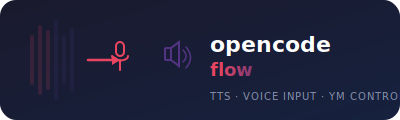

<div align="center">
  
</div>

# opencode-flow

Голосовой ввод (Whisper STT) + Озвучка ответов (ElevenLabs TTS) + Управление Яндекс Музыкой для [OpenCode](https://opencode.ai).

---

## Структура

```
opencode-flow/
├── tts-server/          # TTS-сервер (ElevenLabs)
│   ├── tts_server.py        # Flask-сервер на waitress, порт 4321
│   ├── backend_elevenlabs.py # Обёртка ElevenLabs SDK (таймауты, retry, watchtower)
│   ├── tts_config.py        # Загрузка конфига
│   ├── demo_voices.py       # Демо голосов
│   └── start-tts.ps1        # Меню выбора TTS (ElevenLabs / откл.)
├── whisper/             # Голосовой ввод
│   ├── whisper_listener.py  # VAD + faster-whisper + SendInput
│   ├── run-whisper.ps1      # Авторестарт-обёртка
│   └── start-voice.ps1      # Запуск whisper + оверлеев
├── overlays/            # Плавающие индикаторы
│   ├── status_overlay.py    # Статус Whisper (слушает/молчит)
│   └── tts_overlay.py       # Статус TTS (загрузка/говорит/ошибка)
├── ym-control/          # Управление Яндекс Музыкой через CDP
│   ├── media-control.ps1    # Обёртка: next, prev, playpause, like, volume
│   ├── ym_control.exe       # C# программа для базовых действий
│   ├── start-ym-debug.ps1   # Запуск YM с remote-debugging-port
│   ├── ym-like-v11.mjs      # Лайк трека через API Яндекса
│   ├── ym-check-fav-api.mjs # Проверка лайкнутых через API
│   ├── ym-search.mjs        # Поиск трека
│   ├── ym-play-exact.mjs    # Воспроизведение конкретного трека
│   ├── ym-play-from-album.mjs # Воспроизведение из альбома
│   ├── ym-now-playing.mjs   # Что сейчас играет
│   ├── ym-resume.mjs        # Пауза/плей
│   └── ym-inspect.mjs       # Инспекция страницы YM
├── plugin/              # Плагин OpenCode
│   └── tts.ts               # Автоозвучка ответов, мониторинг оверлеев
└── config/              # Конфиги (в .gitignore, свои на каждой машине)
    ├── config.json          # Ключ ElevenLabs, voice_id, модель
    ├── voice-config.json    # Настройки Whisper (модель, VAD, язык)
    ├── voice-status.json    # Текущий статус Whisper (пишет listener)
    └── tts-status.json      # Текущий статус TTS (пишет сервер)
```

---

## Компоненты

### TTS (ElevenLabs)

```bash
tts-server/tts_server.py
```

Flask-сервер на `waitress`, порт **4321**. Единственный бэкенд — ElevenLabs.

- Воспроизведение mp3 через MCI (`winmm.dll`) с фоновой очередью
- Keepalive-воркер — пинг `/v1/models` каждые 20 с (чтобы TLS-туннель не засыпал)
- Watchtower-воркер — проверка соединения каждые 30 с, пересоздание клиента при восстановлении сети
- Статус пишется в `~/.opencode-tts/tts-status.json`: `loading` / `ready` / `speaking` / `error`
- Установка: `start-tts.ps1` — меню выбора

**Зависимости (Conda env `elevenlabs`):**
```
flask, waitress, elevenlabs, requests
```

**Примечание:** ElevenLabs API заблокирован в РФ — нужен full-tunnel VPN.

---

### Voice Input (Whisper STT)

```bash
whisper/whisper_listener.py
```

VAD (энергетический детектор) + `faster-whisper` (модель `medium`) на CUDA.

- Ввод текста в активное окно через `SendInput` (юникод)
- Фильтр галлюцинаций (стоп-фразы, короткий/повторяющийся текст)
- Typewriter-режим с задержкой 40 мс между символами
- Горячие клавиши: **Ctrl+Shift+V** (пауза/возобновить), **Ctrl+Shift+Q** (выход)
- Автоматически замолкает, когда TTS говорит (читает `tts-status.json`)

**Зависимости (Conda env `chatterbox-tts`):**
```
faster-whisper, sounddevice, numpy, pynput
```

---

### Оверлеи

```bash
overlays/status_overlay.py   # Индикатор Whisper
overlays/tts_overlay.py      # Индикатор TTS
```

Плавающие окна поверх Windows Terminal, показывающие статус:

- Whisper: 🔴 слушает / ⚪ молчит
- TTS: ⏳ загрузка / 🟢 готов / 🟡 говорит / 🔴 ошибка

Привязаны к окну терминала, автоматически ездят за ним через WinEvent-хуки. Если упали — вотчдог в плагине поднимет заново.

---

### Управление Яндекс Музыкой

```bash
ym-control/media-control.ps1 -Action <next|prev|playpause|right|left|like|mute|restart|volume_N>
```

Управление через Chrome DevTools Protocol (CDP) — Yandex Music desktop запускается с `--remote-debugging-port=9222`.

**Доступные действия:**

| Действие | Описание |
|----------|----------|
| `next` | Следующий трек |
| `prev` | Предыдущий трек |
| `playpause` | Пауза / воспроизведение |
| `right` | Перемотка вперёд (×6) |
| `left` | Перемотка назад (×6) |
| `like` | Лайк трека (через API Яндекса) |
| `mute` | Вкл/выкл звук |
| `restart` | Перезапустить трек |
| `volume_N` | Громкость N% (0–100) |

**Лайк трека** — через прямой вызов API Яндекса (YM internal API), так как `ym_control.exe` не работает с новым UI.

Автозапуск YM: `ym-control/start-ym-debug.ps1`, прописан в `HKCU\...\Run`.

---

### Плагин OpenCode

```bash
plugin/tts.ts
```

Устанавливается в `~/.config/opencode/plugin/tts.ts`.

Что делает:
1. Запускает `whisper_listener.py` (голосовой ввод)
2. Запускает `status_overlay.py` (индикатор Whisper)
3. Запускает `tts-server/tts_server.py` (TTS, если выбран не `none`)
4. Запускает `tts_overlay.py` (индикатор TTS)
5. Автоозвучка ответов ассистента (русский текст) при `session.idle`
6. Очистка процессов при выходе

Для автоозвучки: в `~/.opencode-tts/config.json` установить `model_key` в `"elevenlabs"` и указать API-ключ.

---

## Установка

### 1. Python-окружения (Conda)

```powershell
# TTS (ElevenLabs)
conda create -n elevenlabs python=3.11
conda activate elevenlabs
pip install flask waitress elevenlabs requests

# Whisper + Оверлеи
conda create -n chatterbox-tts python=3.11
conda activate chatterbox-tts
pip install faster-whisper sounddevice numpy pynput
```

### 2. Плагин OpenCode

```powershell
copy plugin\tts.ts "$env:USERPROFILE\.config\opencode\plugin\tts.ts"
```

### 3. Конфиги

```powershell
mkdir "$env:USERPROFILE\.opencode-tts"
# config.json — ключ ElevenLabs, voice_id, модель
# voice-config.json — настройки Whisper
```

Либо запустить `tts-server/start-tts.ps1` — он создаст конфиг и предложит меню.

### 4. Яндекс Музыка

```powershell
ym-control/start-ym-debug.ps1    # Запустить YM с debug-портом
ym-control/media-control.ps1 next  # Проверить управление
```

---

## Быстрый старт

```powershell
# 1. Убедиться, что YM запущен с debug-портом
ym-control/start-ym-debug.ps1

# 2. Запустить TTS-сервер
tts-server/start-tts.ps1

# 3. Запустить OpenCode — плагин сам поднимет whisper и оверлеи
opencode
```

---

## Важные детали

- **Яндекс Музыка** — Electron-приложение с кастомным протоколом `music-application://`. CDP работает только через Node.js (`WebSocket`), PowerShell не поддерживает.
- **CDP настройка:** YM desktop запускается с флагом `--remote-debugging-port=9222`. После запуска доступен вкладка `music-application://desktop/` по `http://localhost:9222/json`.
- **Лайк через API:** `POST https://api.music.yandex.net/users/{uid}/likes/tracks/add-multiple` с form-urlencoded телом и OAuth-токеном из `localStorage` YM.
- **Network recovery:** При блокировке ElevenLaaS (РФ) watchtower-воркер проверяет соединение каждые 30 с. Достаточно включить VPN — TTS восстановится без перезапуска.
- **Аудиоустройство:** Для наушников используется `Set-AudioDevice -Index 3` (устройство Vault, модуль `AudioDeviceCmdlets`).

---

## Лицензия

MIT
